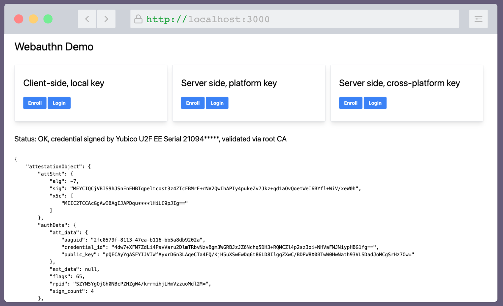

# Webautn Demo

This repository contains a demo of using Webauthn for authentication, which allows you to use:
- Hardware keys, such as YubiKey
- Passkeys, which are cryptographic keys stored in your phone and synchronized to cloud

This demo comes along with my blog post.

## Demo modes

- In the client-side mode, we just do everything in browser, to get a feel of browser API
- In the server mode, we use server authentication, but the credentials are created by the browser and remain local
  to the brower
- In the server cross-platform mode, we try to use true cross-platform authenticators.
  

## Decoding and verification

For illustration purposes, I wrote a few [functions](explore.go) that decode the protocol messages into more
readable form, and show some cryptographic verification. They are purely for illustration, please don't use them
in any production code.

## References

- [Webauthn Standard](https://www.w3.org/TR/webauthn-2/)
- [YubiKey WebAuthn Developer Guide](https://developers.yubico.com/WebAuthn/WebAuthn_Developer_Guide/)
- [iOS Passkeys User Documentation](https://support.apple.com/guide/iphone/sign-in-with-passkeys-iphf538ea8d0/ios)
- [Google Passkeys Developer Documentation](https://developers.google.com/identity/passkeys)
